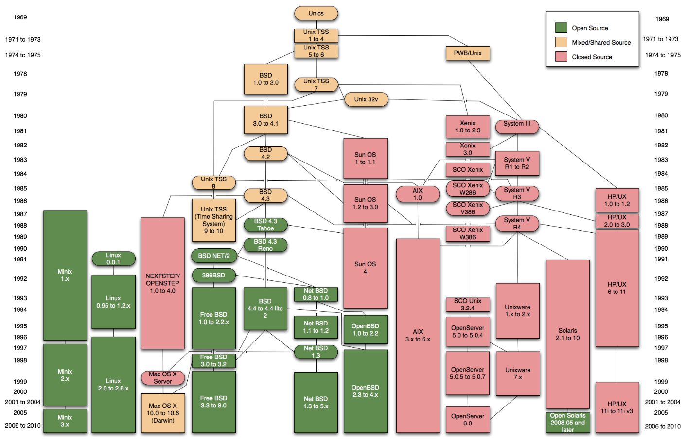
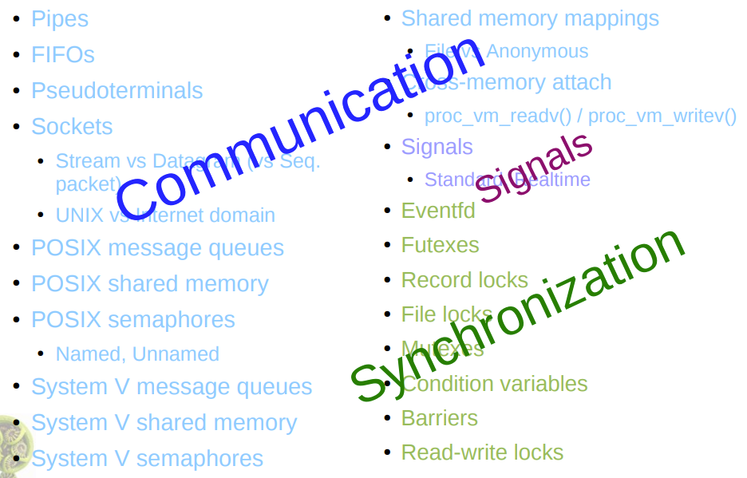

# Start pre-studying SYSTEM V and POSIX
Overview of Unix and Linux history:



Inter-process communication and synchronization in Linux/Unix Operating System:



## SYSTEM V definition
+ System V is a form of Operating System and a relevant standard which was developed by AT&T as a commercial version. System V standards provide many APIs to interact with UNIX kernel from user space.


## POSIX definition
_**A family of standards specified by the IEEE**_ Computer Society for maintaining compatibility between operating systems. Most modern commercial Unix implementations and many free ones are POSIX compliant. There are actually several different POSIX releases, but the most important are POSIX.1 and POSIX.2, which _**define system calls and command-line interface**_, respectively.


## Inter Process Communication and Synchronization Comparison

|    NO     |   Communication   	|   Complexicity   |   Message Size   |   Overhead   |   Direction   |   Restriction   |   Remarks   |
|   :---:   |       :---        	|      :---:       |      :---        |    :---:     |     :---:     |      :---       |    :---     |
|   1       |   Pipe (named & unamed)	|   Low            |   Medium (~64KB) |   High       |   One         |   One direction | Simple/quick implementation. For small project or just previews.
|   2       |   Shared Memory         	|   High           |   Large (~32MB)  |   Lowest     |   Two         |   Poor sync     | Fastest but need a secured synchronization, normally work with semanphores.
|   3       |   Socket               	|   Medium         |   Medium (~64KB) |   Normal     |   Two	     |   Neutral       | Widely used for both loopback and network communication. But overhead of loopback/unix socket still higher than Message Queues. So, primarily used for over-host message passing.
|   4       |   Message Queue           |   Medium         |   Small (~8KB)   |   Low        |   Two         |   Size Limit    | Quite fast, seem only behind Shared Memory, but has limited message&queue size. But thought that it still enough for trivial applications that exchange small and medium messages. System-V-version Message Queue has no file descriptor (it uses an integer), so poor synchronization, need to have an extra thread only to receive messages. Or just using POSIX-version one as an alternative.
|   5       |   Mapped Memmory          |   High           |   Large (~32MB)  |   Very High  |   Two         |   High overhead | High overhead if sending messages between indiviual processes so not practical. Only OK or same as Shared Memory if passing messages between a process and its children.


```
So, conclusions here will be:
1. If passing messages between threads inside a process which will share a same virtual address space: Use local shared memory (applied for a memory space of one process) + Synchronization methods like: pthread conditional variables, mutexes, eventfd & epoll/poll/select,...

2. If passing messages between hosts: Use Network Socket + sockfd & epoll/poll/select,...

3. If passing messages between processes: Use Message Queue (both SysV and POSIX) for small and medium message size, Or use Loopback (both anonymous and file-based) Socket + sockfd & epoll/poll/select,..., Or use Shared Memory (both SysV and POSIX) + semaphores (both SysV and POSIX)/eventfd,...

4. Use pipe only if you want to do a quick pre-test or not a large system.

5. Mostly not use Mapped Memory except for child processes which is fork()-ed from a program which rarely happens in software development.

```

## Remarks:

1. [Brief comparison between POSIX and SysV](https://nyrahul.github.io/systems/engg/2018/04/01/sysv-msgq-vs-posix-msgq/)

_**Sysv msqq does not offer a file descriptor which can be used in conjunction with select/poll/epoll. This is rather a very big limiting factor for sysv msgqs, since now there is no way of getting the events about message reception asynchronosly.** Essentially if you want to handle sysv msgqs then you have to poll in msgrcv() in non-blocking mode or block on msgrcv in a separate thread._

2. 

_System V IPC are deprecated, for any new project, it is advised to use the POSIX counterparts (man 7 shm_overview and man 7 mq_overview)._


## References:
1. [Overview of Unix and Linux history (note that it's in Vietnamese)](https://robusta.vn/vi/goc-cong-nghe/unix-vs-linux.-nguon-goc-va-su-khac-biet)
1. [POSIX vs System V](https://eslinuxprogramming.blogspot.com/2015/06/posix-vs-system-v.html)
2. [SysV Wiki](https://en.wikipedia.org/wiki/UNIX_System_V)
3. [POSIX Wiki](https://en.wikipedia.org/wiki/POSIX)
4. [SysV man7](https://manned.org/svipc.7)
5. [Process and Thread](https://eslinuxprogramming.blogspot.com/2015/06/process-va-thread.html)
6. [SysV Message Queue](https://www.softprayog.in/programming/interprocess-communication-using-system-v-message-queues-in-linux)
7. [SysV Shared Memory](https://www.softprayog.in/programming/interprocess-communication-using-system-v-shared-memory-in-linux)
8. [Man7 PDF IPC Overview](https://man7.org/conf/lca2013/IPC_Overview-LCA-2013-printable.pdf)
9. [Brief comparison between POSIX and SysV](https://nyrahul.github.io/systems/engg/2018/04/01/sysv-msgq-vs-posix-msgq/)