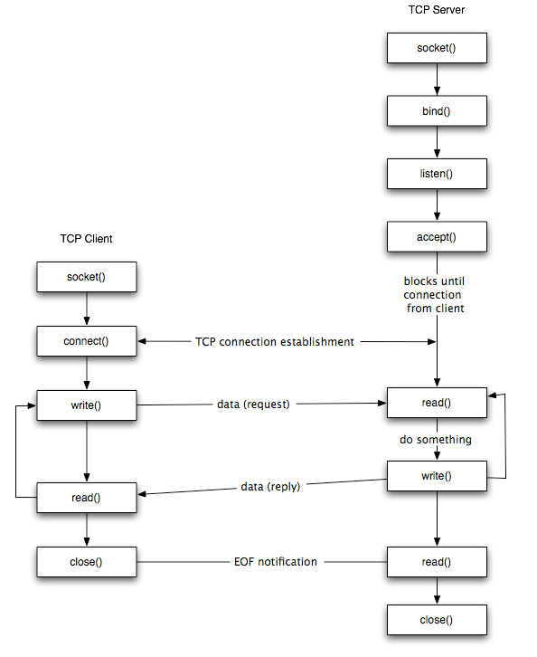

## Basic Knowledge

```
Where:
	1. TCP Server is our itccoord (see handle_locate_coord_request()).
	2. TCP Client is processes that using ITC system (see lsock_init()).
```




## References:
1. [Socket Programming Basic Knowledge](https://www.cs.dartmouth.edu/~campbell/cs50/socketprogramming.html)
2. [Detail Explanation Socket APIs](https://notes.shichao.io/unp/ch4/)